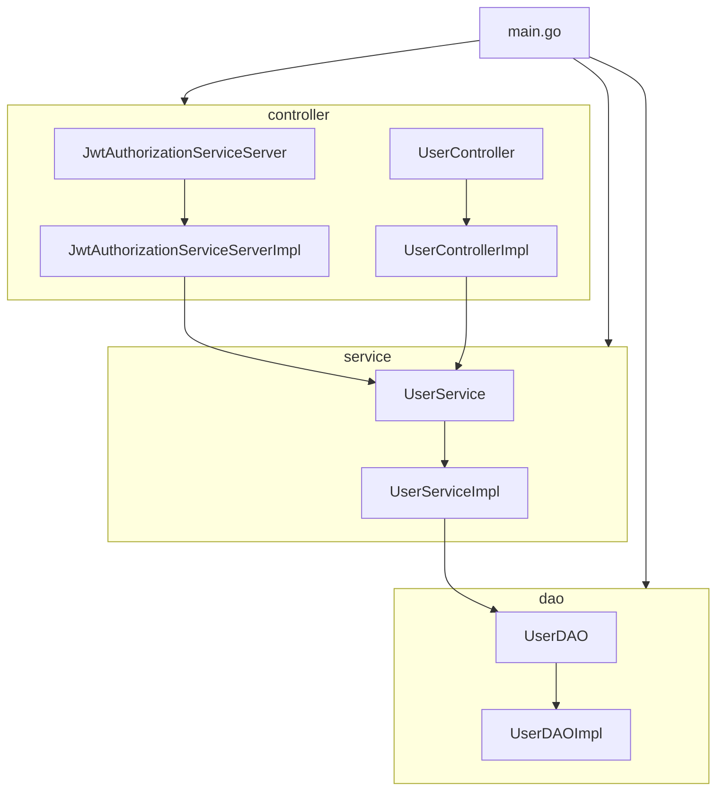

# JWT_authorization

[English version](./README_en.md)

一个使用了JWT + MySQL + Redis + gRPC 技术栈的用户认证,权限控制的Demo项目,项目提供了HTTP接口以及gRPC接口

## 项目模型

项目采用了通用脚手架:CLD模型,其中controller层,service层以及dao层均使用了接口

项目使用了**依赖注入**的方式,这种方式可以实现一个清晰、模块化且易于维护的代码结构，每一层都有自己的接口，并通过依赖注入实现了层之间的解耦。

层之间的注入关系:



+ main.go：项目的入口文件，负责初始化和依赖注入。
+ controller层包含两个接口JwtAuthorizationServiceServer和UserController，以及它们的实现JwtAuthorizationServiceServerImpl和UserControllerImpl。
+ service层包含接口UserService及其实现UserServiceImpl。
+ dao层包含接口UserDAO及其实现UserDAOImpl。
+ JwtAuthorizationServiceServerImpl和UserControllerImpl依赖于UserService。
+ UserServiceImpl依赖于UserDAO。

## 项目结构

```
.
├── README.md
├── README_zh.md
├── code
│   └── code.go
├── config
│   └── config.go
├── config.json
├── docs
│   └── JWT.postman_collection.json
├── go.mod
├── go.sum
├── internal
│   ├── controller
│   │   ├── gRPCController
│   │   │   └── gRPCInterface.go
│   │   └── httpController
│   │       ├── contextKey.go
│   │       ├── controllerInterface.go
│   │       ├── deleteUser.go
│   │       ├── frozen.go
│   │       ├── getUserID.go
│   │       ├── login.go
│   │       ├── logout.go
│   │       ├── permission.go
│   │       ├── refreshToken.go
│   │       ├── register.go
│   │       └── response.go
│   ├── dao
│   │   ├── daoInterface.go
│   │   ├── token.go
│   │   └── user.go
│   └── service
│       ├── EncryptPassword.go
│       ├── deleteUser.go
│       ├── frozen.go
│       ├── login.go
│       ├── logout.go
│       ├── permission.go
│       ├── refreshToken.go
│       ├── register.go
│       └── serviceInterface.go
├── main.go
├── middleware
│   ├── adminMiddleware.go
│   ├── gRPCJWTmiddleware.go
│   └── jwtMiddleware.go
├── model
│   ├── apiError.go
│   ├── token.go
│   └── user.go
├── proto
│   ├── jwt_authorization.pb.go
│   ├── jwt_authorization.proto
│   └── jwt_authorization_grpc.pb.go
├── route
│   └── route.go
└── util
    ├── MySQL
    │   └── MySQL.go
    ├── Redis
    │   └── Redis.go
    ├── initSQL.go
    └── jwt
        └── jwt.go

18 directories, 47 files

```

## 项目配置
需要编写config.json并且放在项目根目录下
config.json格式:
```json
{
  "address":"127.0.0.1",
  "port": 8080,
  "MySQL": {
    "host": "127.0.0.1",
    "port": 3306,
    "username": "admin",
    "password": "admin",
    "database": "database"
  },
  "Redis": {
    "host": "127.0.0.1",
    "port": 6379,
    "username": "admin",
    "password": "admin",
    "database": 0
  },
  "JWT": {
    "secret": "secret"
  },
  "gRPC": {
    "host": "127.0.0.1",
    "port": 50051
  },
  "passwordSecret": "passwordSecret"
}
```

## 项目启动
终端执行下列指令:
```shell
go run main.go
```
## 项目接口:

[http Postman json](./docs/JWT.postman_collection.json)

[gRPC proto](./proto/jwt_authorization.proto)

## 状态码

| Error Code                | Description                        |
|---------------------------|------------------------------------|
| 1000                      | Success                            |
| 1001                      | RequestTimeout                     |
| 1002                      | ServerBusy                         |
| 1003                      | LoginParamsError                   |
| 1004                      | LoginGetUserInformationError       |
| 1005                      | LoginPasswordError                 |
| 1006                      | LoginGenerateTokenError            |
| 1007                      | LoginUserIsFrozen                  |
| 1008                      | LoginUserNotFound                  |
| 1009                      | RegisterParamsError                |
| 1010                      | RegisterCheckUserExistsError       |
| 1011                      | RegisterUsernameExists             |
| 1012                      | RegisterTelephoneExists            |
| 1013                      | RegisterCreateUserError            |
| 1014                      | RequestUnauthorized                |
| 1015                      | RefreshTokenError                  |
| 1016                      | FrozenUserIDRequired               |
| 1017                      | FrozenUserError                    |
| 1018                      | ThawUserIDRequired                 |
| 1019                      | ThawUserError                      |
| 1020                      | DeleteUserError                    |