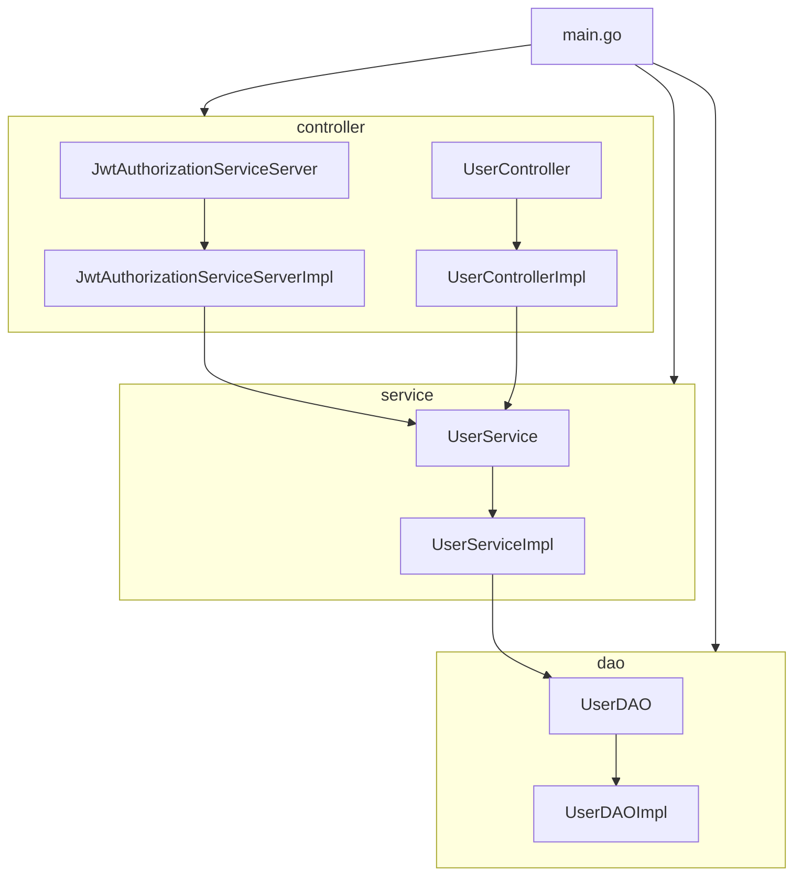

# JWT Authorization

[简体中文](./README)

A demo project for user authentication and authorization control using JWT, MySQL, Redis and gRPC technology stack.
The project provides HTTP API and gRPC API

## Program Model
The project adopts a general scaffold: the CLD model, where the controller layer, service layer, and DAO layer all use interfaces.

The project uses **dependency injection**, which enables a clear, modular, and maintainable code structure. Each layer has its own interface, and dependency injection decouples the layers from each other.

The injection relationship between layers is as follows:



+ main.go: The project's entry file, responsible for initialization and dependency injection.
+ The controller layer contains two interfaces, JwtAuthorizationServiceServer and UserController, and their implementations, JwtAuthorizationServiceServerImpl and UserControllerImpl.
+ The service layer contains the UserService interface and its implementation, UserServiceImpl.
+ The DAO layer contains the UserDAO interface and its implementation, UserDAOImpl.
+ JwtAuthorizationServiceServerImpl and UserControllerImpl depend on UserService.
+ UserServiceImpl depends on UserDAO.

## Project Structure

```
.
├── README.md
├── README_zh.md
├── code
│   └── code.go
├── config
│   └── config.go
├── config.json
├── docs
│   └── JWT.postman_collection.json
├── go.mod
├── go.sum
├── internal
│   ├── controller
│   │   ├── gRPCController
│   │   │   └── gRPCInterface.go
│   │   └── httpController
│   │       ├── contextKey.go
│   │       ├── controllerInterface.go
│   │       ├── deleteUser.go
│   │       ├── frozen.go
│   │       ├── getUserID.go
│   │       ├── login.go
│   │       ├── logout.go
│   │       ├── permission.go
│   │       ├── refreshToken.go
│   │       ├── register.go
│   │       └── response.go
│   ├── dao
│   │   ├── daoInterface.go
│   │   ├── token.go
│   │   └── user.go
│   └── service
│       ├── EncryptPassword.go
│       ├── deleteUser.go
│       ├── frozen.go
│       ├── login.go
│       ├── logout.go
│       ├── permission.go
│       ├── refreshToken.go
│       ├── register.go
│       └── serviceInterface.go
├── main.go
├── middleware
│   ├── adminMiddleware.go
│   ├── gRPCJWTmiddleware.go
│   └── jwtMiddleware.go
├── model
│   ├── apiError.go
│   ├── token.go
│   └── user.go
├── proto
│   ├── jwt_authorization.pb.go
│   ├── jwt_authorization.proto
│   └── jwt_authorization_grpc.pb.go
├── route
│   └── route.go
└── util
    ├── MySQL
    │   └── MySQL.go
    ├── Redis
    │   └── Redis.go
    ├── initSQL.go
    └── jwt
        └── jwt.go

18 directories, 47 files
```

## Project Configuration

You need to create a `config.json` file and place it in the root directory of the project.
The format of `config.json` is:

```json
{
  "address":"127.0.0.1",
  "port": 8080,
  "MySQL": {
    "host": "127.0.0.1",
    "port": 3306,
    "username": "admin",
    "password": "admin",
    "database": "database"
  },
  "Redis": {
    "host": "127.0.0.1",
    "port": 6379,
    "username": "admin",
    "password": "admin",
    "database": 0
  },
  "JWT": {
    "secret": "secret"
  },
  "gRPC": {
    "host": "127.0.0.1",
    "port": 50051
  },
  "passwordSecret": "passwordSecret"
}
```

## Project Startup

Run the following command in the terminal:

```shell
go run main.go
```

## Project APIs:

[Postman json](./docs/JWT.postman_collection.json)

[gRPC proto](./proto/jwt_authorization.proto)

## Status Code

| Error Code                | Description                        |
|---------------------------|------------------------------------|
| 1000                      | Success                            |
| 1001                      | RequestTimeout                     |
| 1002                      | ServerBusy                         |
| 1003                      | LoginParamsError                   |
| 1004                      | LoginGetUserInformationError       |
| 1005                      | LoginPasswordError                 |
| 1006                      | LoginGenerateTokenError            |
| 1007                      | LoginUserIsFrozen                  |
| 1008                      | LoginUserNotFound                  |
| 1009                      | RegisterParamsError                |
| 1010                      | RegisterCheckUserExistsError       |
| 1011                      | RegisterUsernameExists             |
| 1012                      | RegisterTelephoneExists            |
| 1013                      | RegisterCreateUserError            |
| 1014                      | RequestUnauthorized                |
| 1015                      | RefreshTokenError                  |
| 1016                      | FrozenUserIDRequired               |
| 1017                      | FrozenUserError                    |
| 1018                      | ThawUserIDRequired                 |
| 1019                      | ThawUserError                      |
| 1020                      | DeleteUserError                    |